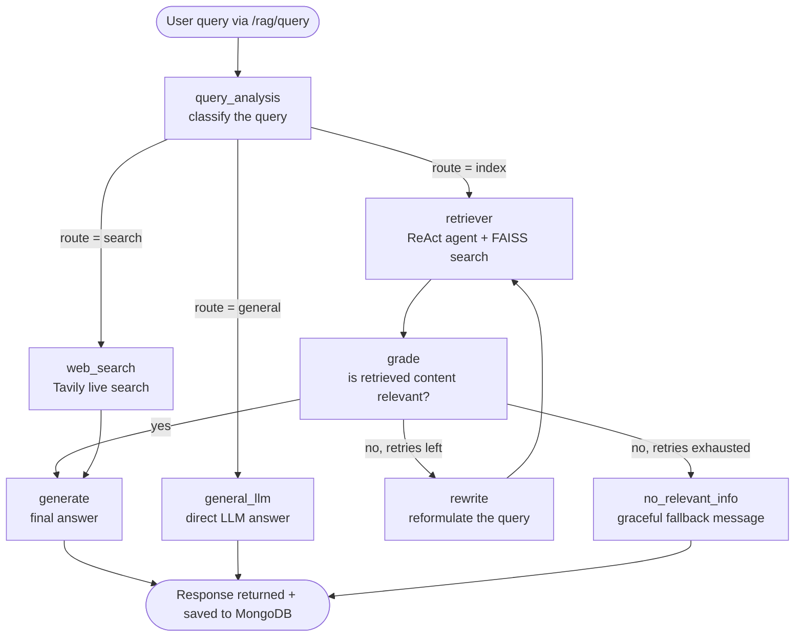

# Adaptive RAG Chatbot

An agentic Retrieval-Augmented Generation (RAG) system that decides, per query, whether to answer from indexed documents, general LLM knowledge, or a live web search — instead of always retrieving the same way.

## Why "adaptive"?

Most basic RAG setups always retrieve, even for questions that don't need it. This project routes each incoming question through a classifier first, then sends it down one of three paths:

| Query type                    | What handles it             |
|--------------------------------|------------------------------|
| Answerable from uploaded docs  | Vector retriever (FAISS)    |
| General knowledge              | Direct LLM call             |
| Needs current/real-time info   | Web search (Tavily)         |

The routing, document-relevance grading, and query rewriting are all orchestrated as a graph using LangGraph, rather than a single linear chain.

## Architecture



Each box above is a node in a LangGraph `StateGraph`. The rewrite loop is capped at **2 retries** (`MAX_RETRIES` in `src/tools/graph_tools.py`) — if the documents genuinely don't have the answer, the graph exits gracefully instead of retrying forever.

## How it works

1. A user query comes in through the FastAPI `/rag/query` endpoint
2. `query_analysis` classifies it as **index**, **general**, or **search**
3. Based on the label, the graph routes to the retriever, a plain LLM call, or a Tavily search
4. If documents were retrieved, `grade` checks they're actually relevant
   - Relevant → straight to `generate`
   - Not relevant, retries remain → `rewrite` the query and try retrieval again
   - Not relevant, retries exhausted → `no_relevant_info` returns a graceful "couldn't find that" message instead of looping
5. The final node returns the response, with the conversation saved to MongoDB under a session ID

Documents are uploaded and chunked/embedded via a separate `/rag/documents/upload` endpoint, then indexed into FAISS for retrieval. The retriever the agent uses is **rebuilt fresh on every request** (`build_agent_executor()` in `src/rag/reAct_agent.py`), so newly uploaded documents are picked up immediately rather than only being visible after a server restart.

## Tech stack

- **Backend:** FastAPI + Uvicorn
- **Orchestration:** LangGraph (ReAct-style agent)
- **LLM:** OpenAI (GPT-4o)
- **Vector store:** FAISS (in-memory). A migration guide to Qdrant for persistent storage is in `QDRANT_SETUP_GUIDE.md`
- **Web search:** Tavily
- **Chat memory:** MongoDB (with in-memory fallback)
- **Frontend:** Streamlit
- **Testing:** pytest, fully mocked — the suite makes zero real API calls

## Project layout

```
.
├── src/
│   ├── main.py              # FastAPI app entry point
│   ├── api/routes.py        # Query + upload endpoints
│   ├── rag/                 # Graph construction, retriever, document upload, ReAct agent
│   ├── models/              # Pydantic / TypedDict schemas (state, grading, routing)
│   ├── tools/                # Graph routing + grading logic
│   ├── llms/                # OpenAI client setup
│   ├── memory/              # MongoDB / in-memory chat history
│   ├── db/                  # Mongo client
│   └── config/              # Settings + prompt templates
├── tests/                   # pytest suite — see "Running the tests" below
├── pytest.ini
└── streamlit_app/           # Chat UI + document upload page
```

## Running it locally

**Requirements:** Python 3.9+, MongoDB, an OpenAI API key, a Tavily API key.

```bash
git clone https://github.com/rahulsingh-17/Adaptive-RAG.git
cd Adaptive-RAG
python -m venv venv
venv\Scripts\activate      # Windows
pip install -r requirements.txt
```

Create a `.env` file:

```
OPENAI_API_KEY=your_key
TAVILY_API_KEY=your_key
MONGODB_URL=mongodb://localhost:27017
MONGODB_DB_NAME=adaptive_rag
```

Then run both services:

```bash
# Terminal 1
python -m uvicorn src.main:app --reload --port 8000

# Terminal 2
streamlit run streamlit_app/home.py
```

- App: http://localhost:8501
- API docs: http://localhost:8000/docs

## Running the tests

The test suite mocks all LLM and embedding calls, so it runs offline with no API keys needed and finishes in a couple of seconds.

```bash
pip install pytest
pytest
```

17 tests covering: query routing, the retry-cap fallback, document upload validation, and a regression test that locks in the retriever-freshness fix described below.

## Engineering notes — bugs found and fixed

While reviewing this project, two real bugs were found, reproduced, fixed, and covered by regression tests:

**1. Uploaded documents were invisible to the agent.**
The ReAct agent's retriever tool used to be built once when the module loaded — before any document existed. Uploading a document swapped in a new vector store, but the already-built agent kept answering from the original empty one. Confirmed by reproducing it directly: after uploading a document, the agent still returned *"No documents have been uploaded yet."* Fixed by rebuilding the agent fresh on every request (`build_agent_executor()`). See `tests/test_retriever_freshness.py`.

**2. The grading/rewrite loop had no exit condition.**
If a document was graded "not relevant," the graph would rewrite the query and retry — with nothing to stop it if the answer genuinely wasn't in the documents. Confirmed this would loop indefinitely (verified by feeding it a fixed "not relevant" grade for 10+ iterations with no termination). Fixed by adding a `retry_count` to the graph state, capped at `MAX_RETRIES = 2`, with a graceful fallback message instead of an infinite loop. See `tests/test_graph_tools.py`.

## What I'd improve next

- [ ] Make the FAISS vectorstore session-scoped instead of a single global (currently all users share one document store)
- [ ] Wire up the `verify_answer` hallucination check that exists in `graph_tools.py` but isn't yet connected to the graph
- [ ] Add a Dockerfile for one-command setup
- [ ] Support multi-document sessions instead of one collection per upload
- [ ] Move from FAISS in-memory to a persistent store (Qdrant guide already drafted in `QDRANT_SETUP_GUIDE.md`)
